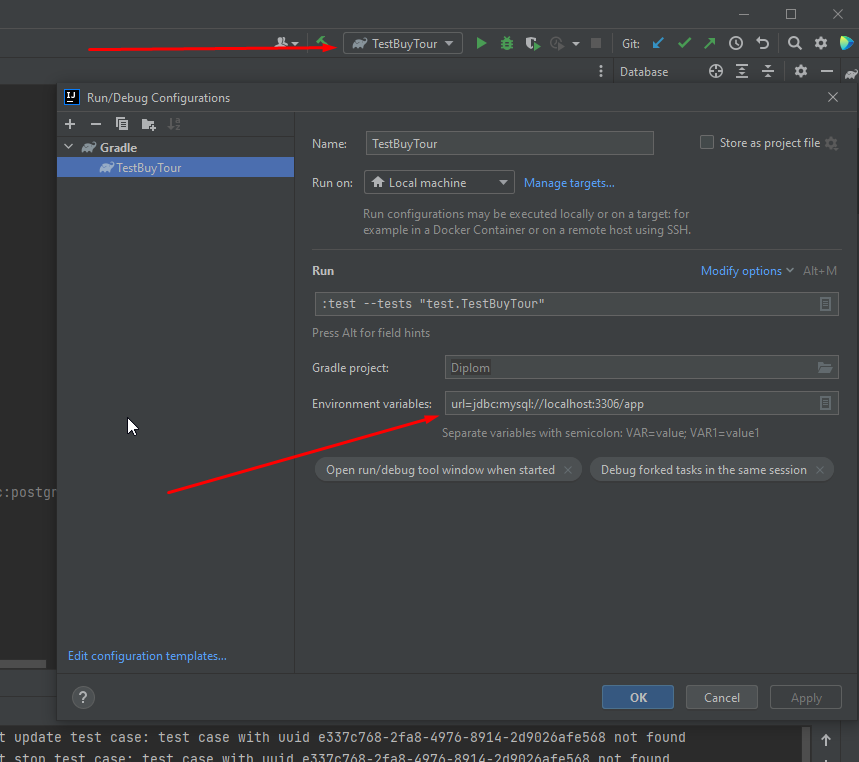

## Инструкция по запуску автотестов.
### Требуемые приложенния для запуска.
* IDEA
* GIT
* NodeJS. 
* Docker. 
* Google Chrome браузер.
### Шаги для запуска
1. Открыть консоль в папке которая будет использоваться для работы с репозиторием
2. Создать локальный репозиторий на своем пк командой git init.
<<<<<<< HEAD
3. Создать проект с помощью IDE в той же папке, что и созданный ранее репозиторий.
4. С помощью команды Git Clone клонировать удаленный репозиторий на свой пк.
* Все дальнейшие операции можно произовдить в консоли IDEA
5. В консоли ввести команду **cd gate-simulator**. Для перехода в данную папку
6. В консоли ввести команду **npm start**. Для запуска симуляциии банка.
7. Запустить Docker Desktop. 
8. В консоли прописать `docker-compose up`  для создания контейнера и запуска.
9. В консоли ввести `java -jar artifacts/aqa-shop.jar` Для запуска тестируемого веб-приложения.
10. Проверить работоспосбность сайта [тут](http://localhost:8080/)
11. С помощью сочетания клавиш ctrl + shift + f10 запустить тесты.
### Настройки для запуска на СУБД Postgresql.

#### Настройки файла docker-compose.yml
    version: '3.7'
    services:
    postgres:
    image: postgres:latest
    ports:
    - '5432:5432'
    environment:
    - POSTGRES_DB=app
    - POSTGRES_USER=user
    - POSTGRES_PASSWORD=pass

#### Запуск приложения происходит с специальным флагом.
* ` Java -jar artifacts/aqa-shop.jar --spring.profiles.active=post `
* Для тестов меняется В конфигурации Environment variable на `url=jdbc:postgresql://localhost:5432/app`

  
